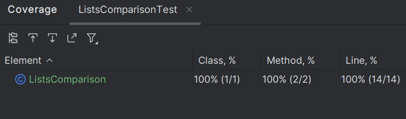
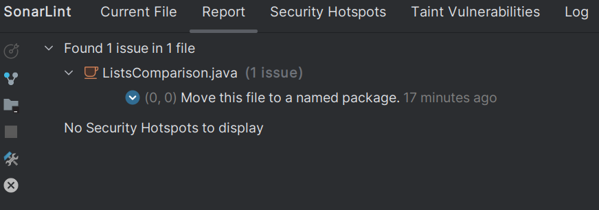

### Отчет о покрытии тестами:

### Отчет Sonarlint:

### Тестами покрыты сценарии:

- Один (или оба) списка, являются __null__-ами: должно выброситься _NullPointerException_.
- Если список пустой, его среднее значение должно быть нулевым.
- Правильность вычисления среднего значения.
- Равные средние значения
- Среднее второго списка больше
- Среднее первого списка больше